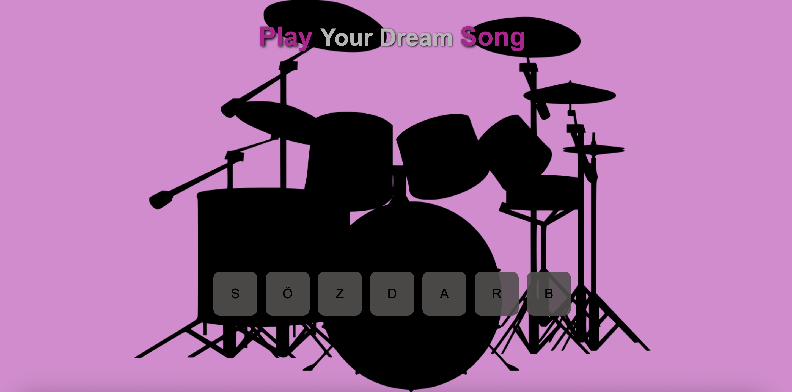

# Guitar Drum Kit

Bu proje, klavye tuşları veya ekrandaki butonlar ile farklı davul seslerini çalabileceğiniz interaktif bir uygulamadır.

## Özellikler

- Klavyeden veya ekrandaki butonlara tıklayarak ses çıkarma
- Her tuşa farklı davul sesi atanmıştır
- Basit ve kullanıcı dostu arayüz
- Hızlı tepki süresi

## Kullanım

1. Proje dosyalarını bilgisayarınıza indirin.
2. `index.html` dosyasını bir tarayıcıda açın.
3. Klavyeden S, Ö, Z, D, A, R, B tuşlarına basarak veya ekrandaki butonlara tıklayarak davul seslerini çalabilirsiniz.

## Dosya Yapısı

- `index.html` : Ana HTML dosyası
- `style.css` : Stil dosyası
- `script.js` : JavaScript dosyası (davul seslerini yönetir)
- Ses dosyaları: Farklı tuşlara atanmış `.wav` ve `.mp3` dosyaları

## Ekran Görüntüsü

## Lisans

MIT Lisansı ile sunulmuştur.