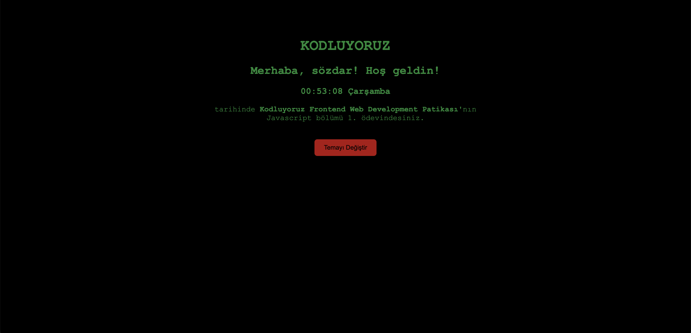
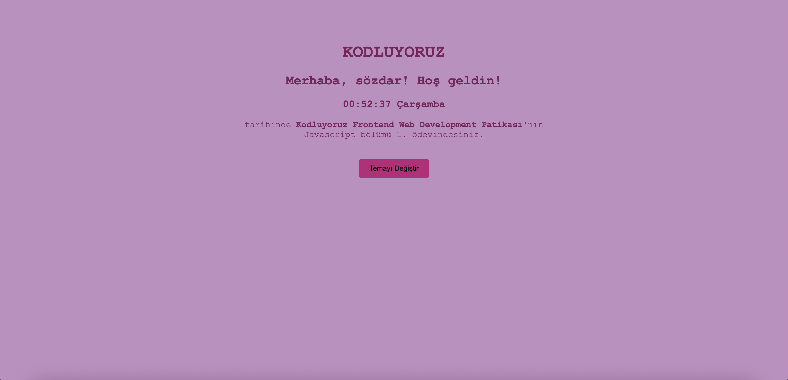

# JavaScript Saat ve Karşılama Projesi

Bu proje, kullanıcıya günün saatine göre dinamik bir karşılama mesajı ve anlık saat bilgisini gösteren bir JavaScript uygulamasıdır.

## Özellikler

- **Canlı Saat:** Sayfada anlık olarak güncellenen saat gösterimi.
- **Dinamik Karşılama:** Kullanıcının saatine göre "Günaydın", "İyi günler", "İyi akşamlar" gibi mesajlar.
- **Tema Değiştirme:** Farklı tema seçenekleriyle görünümü değiştirme.

## Kullanılan Teknolojiler

- HTML
- CSS
- JavaScript

## Nasıl Çalışır?

1. Projeyi bilgisayarınıza indirin veya klonlayın.
2. `index.html` dosyasını bir tarayıcıda açın.
3. Saat ve karşılama mesajı otomatik olarak ekranda görüntülenecektir.

## Ekran Görüntüleri

---
**Hazırlayan:**  
[Sözdar Başboğa]