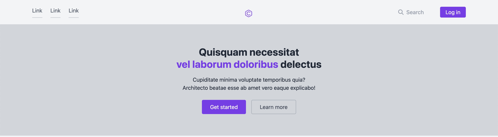
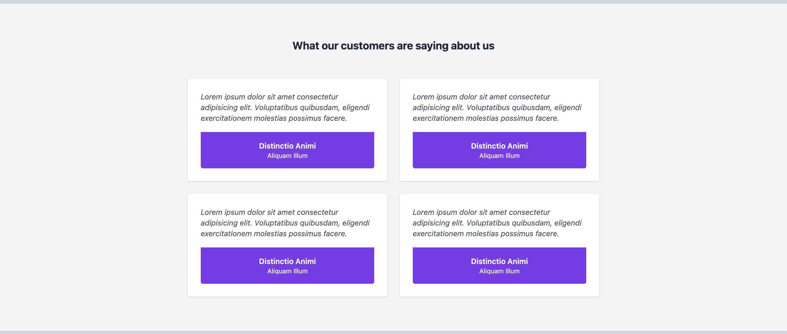
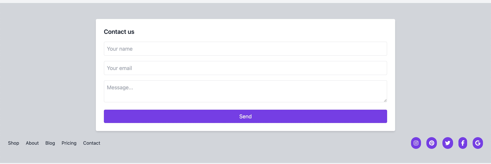

# TailwindCSS Review Page

Bu proje bir **Review Page** örneğidir. Proje tamamen **Tailwind CSS** kullanılarak tasarlanmıştır.

## 🚀 Proje Özellikleri

- Responsive (mobil uyumlu) tasarım
- Tailwind CSS framework ile tamamen stilize edilmiş
- Font Awesome 6 ikonları entegre
- Form, grid, testimonial ve contact section içeren tam sayfa

## 🛠 Kullanılan Teknolojiler

- HTML5
- Tailwind CSS
- Font Awesome (CDN ile)

## 📁 Dosya Yapısı

- `index.html`: Ana sayfa

## Ekran Görüntüsü

